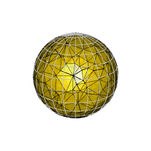

Quantifying uniformity of a configuration of points on a space is a topic that is receiving growing attention in computer science, physics and mathematics. The problem has interesting connections with statistics where several tests of uniformity have been introduced. Other figures-of-merit have been introduced in numerical analysis. The objective of the project is to investigate the behavior of these measures of uniformity using tools at the interface between statistics and numerical analysis.
